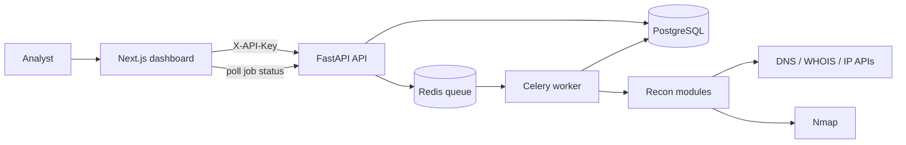

# CyberRecon

CyberRecon is a full-stack, asynchronous reconnaissance platform for security learning and authorized assessments. It combines a Next.js operations dashboard with a FastAPI API, a durable Redis/Celery job queue, PostgreSQL persistence, and containerized deployment.

> Only scan domains and systems that you own or are explicitly authorized to assess.

## What it demonstrates

- Automated DNS, WHOIS, IP, subdomain, port, and technology discovery
- Durable background jobs with queued, running, completed, and failed states
- Persistent scan history and structured results in PostgreSQL
- API-key authentication, rate limiting, CORS controls, and target validation
- Protection against scans of private, loopback, link-local, and reserved networks
- Dockerized API, worker, PostgreSQL, and Redis services
- Automated backend tests, frontend checks, dependency audits, and container builds

## Architecture



The API validates and queues each request. A separate Celery worker performs the reconnaissance and stores its results in PostgreSQL, so API restarts do not silently discard queued work. The dashboard polls the API and renders current status, intelligence panels, and scan history.

## Technology stack

| Layer | Technologies |
| --- | --- |
| Frontend | Next.js, React, TypeScript, Tailwind CSS |
| API | Python, FastAPI, SQLAlchemy, Uvicorn |
| Jobs | Celery, Redis |
| Data | PostgreSQL |
| Recon | Nmap, DNS, WHOIS, IP intelligence |
| Delivery | Docker Compose, GitHub Actions |

## Run the production-style stack locally

Requirements: Docker Desktop and Docker Compose.

```powershell
git clone https://github.com/Learnlife001/cyberrecon.git
cd cyberrecon
Copy-Item .env.example .env
```

Generate a long random value for `SCAN_API_KEY` in `.env`, then start the services:

```powershell
docker compose up --build -d
docker compose ps
```

The API is available at `http://localhost:8000`, with interactive documentation at `http://localhost:8000/docs`. Configure the frontend separately:

```powershell
Set-Location frontend
Copy-Item .env.example .env.local
npm install
npm run dev
```

Open `http://localhost:3000`, enter the same API key in dashboard settings, and submit an authorized public domain.

If port 8000 is already occupied, set `API_PORT` in `.env`, for example `API_PORT=8002`.

## Configuration

The root `.env.example` documents all backend settings. The important production values are:

| Variable | Purpose |
| --- | --- |
| `DATABASE_URL` | PostgreSQL connection string |
| `REDIS_URL` | Redis broker used by Celery |
| `TASK_QUEUE_MODE` | Use `celery` for durable jobs or `inprocess` for development |
| `SCAN_API_KEY` | Secret required in the `X-API-Key` header |
| `ALLOWED_ORIGINS` | Comma-separated trusted frontend origins |
| `SCAN_RATE_LIMIT` | Maximum scan submissions per rate window |
| `NMAP_PATH` | Optional explicit path to the Nmap executable |

Secrets are loaded from the environment and must never be committed. `.env` files are excluded from both Git and Docker build context.

## API workflow

1. `POST /scan` validates the target and returns a job identifier.
2. Redis holds the durable task until a Celery worker accepts it.
3. `GET /results/{job_id}` reports `queued`, `running`, `completed`, or `failed`.
4. `GET /scans` returns persistent scan history.
5. `GET /health` reports database health and the configured queue mode.

Protected endpoints require:

```http
X-API-Key: your-configured-key
```

## Security controls

- Domains are normalized and resolved before scanning.
- Targets resolving to non-public address ranges are rejected.
- Scan endpoints require constant-time API-key validation.
- Scan creation is rate-limited by client address.
- CORS is restricted through configured origins.
- Containers run as an unprivileged application user.
- CI runs unit tests, Bandit, pip-audit, frontend lint/build/audit, and a Docker build.

These controls reduce accidental misuse; they do not turn the application into a multi-tenant commercial scanning service. Production use should add centralized identity, distributed rate limiting, audit logging, monitoring, and explicit authorization records.

## Development checks

```powershell
.\.venv\Scripts\python.exe -m unittest discover -s tests -v
.\.venv\Scripts\python.exe -m compileall -q api_server.py worker.py modules
Set-Location frontend
npm run lint
npm run build
```

## Portfolio highlights

- Designed a resilient asynchronous scanning workflow instead of running long reconnaissance tasks inside request handlers.
- Implemented security boundaries around authentication, public-target validation, rate limiting, secrets, and container privileges.
- Integrated a responsive security operations interface with persisted intelligence and job-state tracking.

## Author

Chigozie Okuma — [GitHub](https://github.com/Learnlife001) · [LinkedIn](https://www.linkedin.com/in/cjokuma23/) · [Portfolio](https://learnlife-portfolio.vercel.app/)
